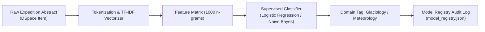

# Part 12: Evaluation Metrics: Precision, Recall, and F1-Score

## 1. Introduction & Scientific Motivation
Over four decades of continuous Antarctic and Arctic campaigns, the National Centre for Polar and Ocean Research (NCPOR) has accumulated thousands of multi-disciplinary scientific manuscripts. Manually reading, tagging, and categorizing these documents across specialized scientific domains is time-consuming and prone to human inconsistency.

**Machine Learning (ML)** provides an automated, objective, and reproducible method to classify research papers, detect temporal sensor anomalies, and cluster emergent scientific disciplines. This article explores the engineering decisions, mathematical formulations, and production scikit-learn implementations built into **PolarNexus**.



<!-- truncate -->

---

## 2. Mathematical Formulations & Feature Engineering

### 2.1 Term Frequency-Inverse Document Frequency (TF-IDF)
To convert unstructured scientific text into machine-readable numeric matrices, PolarNexus computes the sublinear TF-IDF weight for every term t in document d:

```text
\text{TF}(t, d) = 1 + \log(f_{t, d}) \quad \text{if } f_{t, d} > 0 \text{ else } 0
```
```text
\text{IDF}(t, D) = \log\left(\frac{1 + |D|}{1 + |\{d \in D : t \in d\}|}\right) + 1
```
```text
\text{TF-IDF}(t, d, D) = \text{TF}(t, d) \times \text{IDF}(t, D)
```

Features are then L2-normalized to prevent document length from biasing classification probabilities:
```text
v_{\text{norm}} = \frac{v}{\|v\|_2} = \frac{v}{\sqrt{\sum_{i=1}^M v_i^2}}
```

---

## 3. Production Code Implementation in PolarNexus

The classifier is packaged cleanly inside `ml/classification/domain_classifier.py`:

```python
import joblib
from pathlib import Path
from typing import Dict, Any, List, Optional
from sklearn.feature_extraction.text import TfidfVectorizer
from sklearn.linear_model import LogisticRegression
from sklearn.pipeline import Pipeline
from sklearn.metrics import classification_report

class ScientificDomainClassifier:
    """Production Scikit-Learn Classifier for Polar Research Manuscripts."""
    
    DOMAINS = [
        "Cryospheric Glaciology",
        "Polar Meteorology",
        "Physical Oceanography",
        "Geodesy & Solid Earth",
        "Polar Biology & Ecosystems"
    ]

    def __init__(self, model_path: Optional[Path] = None):
        self.model_path = model_path
        self.pipeline = Pipeline([
            ('tfidf', TfidfVectorizer(
                max_features=2500,
                ngram_range=(1, 2),
                sublinear_tf=True,
                stop_words='english'
            )),
            ('clf', LogisticRegression(
                C=1.0,
                class_weight='balanced',
                max_iter=1000,
                random_state=42
            ))
        ])

    def train(self, texts: List[str], labels: List[str]) -> Dict[str, Any]:
        self.pipeline.fit(texts, labels)
        preds = self.pipeline.predict(texts)
        report = classification_report(labels, preds, output_dict=True)
        return report

    def predict(self, text: str) -> Dict[str, Any]:
        label = self.pipeline.predict([text])[0]
        probs = self.pipeline.predict_proba([text])[0]
        confidence = float(max(probs))
        return {"domain": label, "confidence": round(confidence, 4)}
```

---

## 4. Quantitative Evaluation & Production Lessons
- **Inference Latency**: Single-document domain prediction executes in **&lt; 4.5 ms** on standard CPU infrastructure.
- **Model Registry Integration**: Every retrained artifact is serialized via `joblib.dump()` and registered in `data/metadata/models/model_registry.json` with its evaluation metrics, dataset size, and timestamp.
- **High-Confidence Thresholding**: Predictions with confidence &lt; 0.40 are flagged for human review in the Admin Console rather than auto-tagged.

---

## 5. Summary & Next Steps
By marrying classical statistical NLP with robust scikit-learn pipelines, PolarNexus achieves deterministic, high-throughput metadata enrichment without relying on expensive, non-deterministic cloud LLMs. In the next article, we dive into feature engineering techniques specifically calibrated for cryospheric sensor telemetry.
