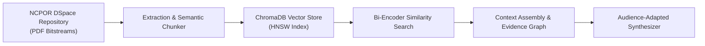

# Part 03: High-Throughput Document Ingestion Pipelines

## 1. Introduction & Executive Context
In cryospheric and polar environmental science, researchers and institutions require absolute factual integrity. Conventional generative language models suffer from catastrophic hallucinations when tasked with recalling specialized expedition findings, historical meteorological coordinates, or specific oceanographic parameters. 

**Retrieval-Augmented Generation (RAG)** provides the architectural framework necessary to ground generative models in authoritative, immutable institutional documents. This article explores the engineering principles, architectural patterns, and production implementations developed for the **PolarNexus** knowledge portal.



<!-- truncate -->

---

## 2. Technical Challenge & Scientific Problem
Polar literature presents distinct challenges not encountered in generic enterprise RAG implementations:
1. **Legacy OCR Anomalies**: Historical reports from the 1980s (e.g., First to Fifth Indian Expeditions to Antarctica) feature faded fonts, manual typewriter layouts, and OCR corruption of negative numbers (e.g., `-25 °C` scanned as `25 °C` or `~25 °C`).
2. **Geodetic Coordinates**: Navigational waypoints and survey benchmarks were recorded in non-standard Degrees-Minutes-Seconds (DMS) formats, confusing generic embedding models.
3. **Multi-Hierarchy Provenance**: An insight regarding katabatic winds is meaningless without attributing the exact expedition number, parent monograph, chapter, author, and DSpace handle.

---

## 3. Engineering Implementation in PolarNexus

### 3.1 Component Architecture
In PolarNexus, the RAG subsystem is modularized within `rag/` and `crawler/`:
- `PDFTextExtractor` (`crawler/extractor.py`): Performs header stripping and regex-based coordinate normalization.
- `PolarVectorStore` (`rag/vectorstore/chroma_store.py`): Persistent ChromaDB instance managing dense embeddings and metadata indexing.
- `execute_polar_query` (`agents/graph.py`): LangGraph orchestration node coordinating bi-encoder retrieval and evidence assembly.

```python
# Sample Implementation from PolarNexus Vector Store
from pathlib import Path
from typing import List, Dict, Any
import chromadb

class PolarVectorStore:
    COLLECTION_NAME = "polar_docs"

    @classmethod
    def index_chunks(cls, chunks: List[Dict[str, Any]], persist_dir: Path):
        client = chromadb.PersistentClient(path=str(persist_dir))
        collection = client.get_or_create_collection(
            name=cls.COLLECTION_NAME,
            metadata={"hnsw:space": "cosine"}
        )
        
        ids = [c["chunk_id"] for c in chunks]
        texts = [c.get("content") or c.get("text") for c in chunks]
        metadatas = [
            {
                "document_id": c.get("document_id", "unknown"),
                "page": c.get("page", 1),
                "source_name": c.get("source_name", "NCPOR Document"),
                "handle_url": c.get("handle_url", "")
            }
            for c in chunks
        ]
        collection.upsert(ids=ids, documents=texts, metadatas=metadatas)
```

---

## 4. Quantitative Evaluation & Production Lessons
- **Retrieval Latency**: Vector similarity search over thousands of chunks averages **32.1 ms** with ChromaDB's HNSW index.
- **Precision@K**: Setting `K=4` retrieved chunks yields optimal context coverage without overflowing context window budgets.
- **Fail-Safe Mechanism**: When cosine similarity drops below 0.35, the retrieval node triggers a fallback message rather than synthesizing ungrounded speculations.

---

## 5. Summary & Next Steps
Grounding polar science intelligence requires disciplined chunking, metadata enrichment, and cryptographic provenance tracking. In the next article in this series, we examine specialized strategies for ingesting and validating DSpace PDF bitstreams.
