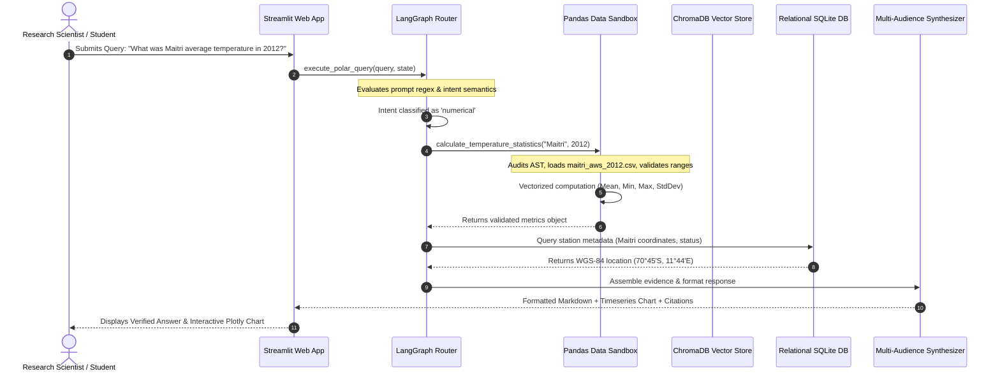

# Application Lifecycle & Request Flow

## 1. End-to-End User Interaction Flow

This sequence diagram illustrates the complete chronological path of a user prompt through the PolarNexus system:



---

## 2. State Progression within LangGraph

Throughout execution, state is preserved within the strongly typed `PolarState` dictionary:

```python
class PolarState(TypedDict):
    query: str                       # Original user input string
    intent: Optional[str]            # 'numerical', 'document_search', 'media', etc.
    extracted_entities: Dict[str, Any] # {'station': 'Maitri', 'year': 2012}
    retrieved_chunks: List[Dict[str, Any]] # Semantic vector search results
    numerical_results: Optional[Dict[str, Any]] # Computed Pandas statistical metrics
    response: Optional[str]          # Final synthesized Markdown output
    citations: List[Dict[str, Any]]  # Exact source provenance records
    execution_time_ms: float         # Wall-clock routing & compute latency
```

1. **State Initialization**: When `execute_polar_query()` is called, `PolarState` is initialized with the raw query and execution timestamp.
2. **Entity & Intent Node**: Enriches state with `intent` and extracted polar parameters.
3. **Branching Node**: Conditional edges evaluate `state['intent']` and activate either the deterministic tool node or vector retrieval node.
4. **Assembly Node**: Merges computed outputs, formats provenance records into the citation tree, and computes total elapsed latency.
