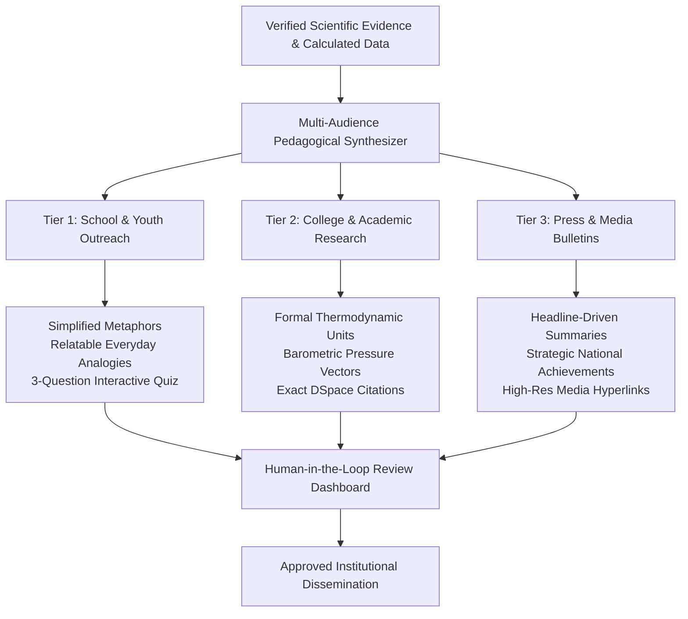

# AI-Powered Outreach & Content Generation

## 1. Multi-Audience Synthesis Pipeline

PolarNexus incorporates an intelligent dissemination pipeline that translates dense scientific manuscripts into clear, verified content tailored for diverse societal groups:

---

## 2. Architectural Guardrails for Generated Outreach

1. **Strict Factual Invariance**: The underlying facts (station coordinates, expedition dates, recorded temperature extremes) remain identical across all tiers. Only vocabulary and sentence complexity are adapted.
2. **Mandatory Citations**: Every generated draft includes source document titles, lead authors, and repository handle URLs.
3. **No Unsubstantiated Claims**: Speculative adjectives (*e.g., "revolutionary", "unprecedented"*) are omitted unless directly quoting the peer-reviewed report text.
