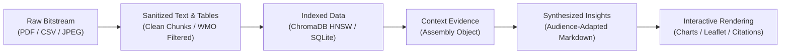

# System Data Flow & Pipeline Transformations

## 1. Data Transformation Pipeline

Data transitions through six distinct lifecycle stages within the PolarNexus ecosystem:

---

## 2. Ingestion-to-Storage Stage Details

### Stage 1: Extraction & Ingestion
- **Input**: Raw unindexed PDF files from NCPOR DSpace and raw CSV streams from NPDC.
- **Action**: `PDFDownloader` streams the file, verifying bytes and checking hashes. `PDFTextExtractor` strips non-informational headers and footers.
- **Output**: Pure text files stored in `data/extracted/` and raw PDFs in `data/raw/pdfs/`.

### Stage 2: Normalization & Chunking
- **Input**: Extracted text and raw sensor tables.
- **Action**: Section-aware chunking breaks documents into 500-token semantic chunks with 50-token overlap, tagging each chunk with `document_id`, `page_number`, `source_name`, and `handle_url`.
- **Output**: JSONL records stored in `data/chunks/document_chunks.jsonl`.

### Stage 3: Semantic & Relational Indexing
- **Input**: JSONL chunks and Dublin Core metadata dictionaries.
- **Action**: Chunks are embedded into vector space via dense embedding models and loaded into ChromaDB. Relational metadata is upserted into SQLite/PostgreSQL.
- **Output**: Queryable ChromaDB collection (`polar_docs`) and synchronized relational database.
