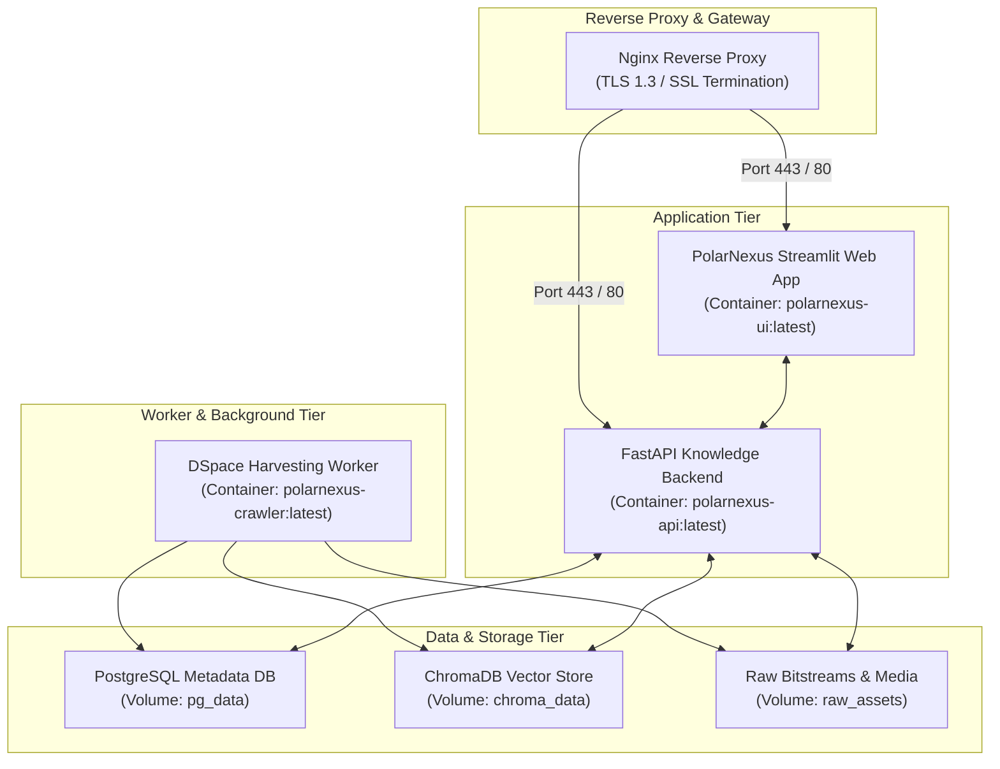

# Deployment Architecture & Container Topology

## 1. Production Docker Topology

PolarNexus is designed for containerized deployment across on-premise institutional servers (NCPOR Goa data center) or sovereign cloud infrastructure (NIC MeghRaj):

---

## 2. Resource Specifications

| Service Container | CPU Allocation | Memory (RAM) Allocation | Persistent Storage |
| :--- | :--- | :--- | :--- |
| **`polarnexus-ui`** | 2 vCPUs | 4 GB | 500 MB (Ephemeral) |
| **`polarnexus-api`** | 2 vCPUs | 4 GB | 500 MB (Ephemeral) |
| **`polarnexus-crawler`** | 1 vCPU | 2 GB | Shared `raw_assets` mount |
| **`chromadb`** | 2 vCPUs | 8 GB | 20 GB (SSD / NVMe) |
| **`postgresql`** | 2 vCPUs | 4 GB | 50 GB (RAID 10) |
