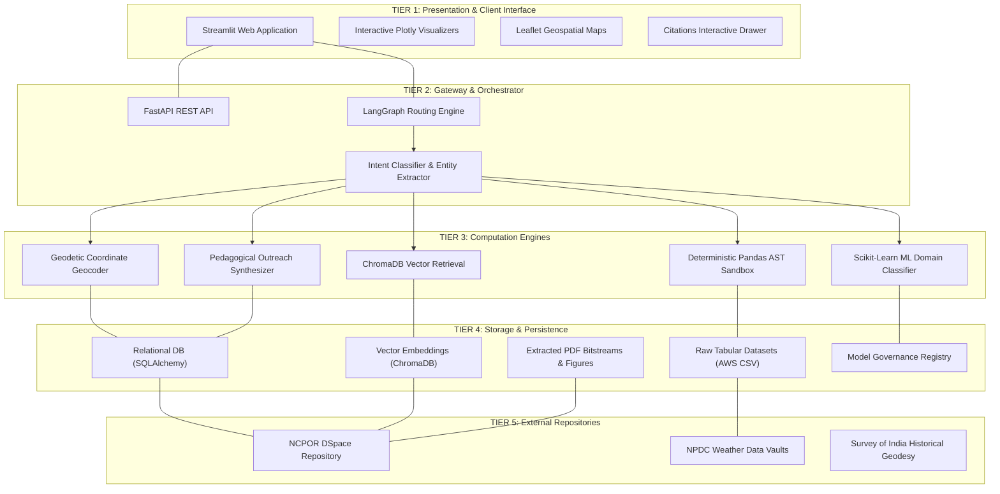

# High-Level Architecture

## 1. Multi-Tier System Topology

PolarNexus is architected as a modular multi-tier distributed platform, segregating presentation, orchestration, computation, and storage layers:

---

## 2. Interaction Between Tiers

### Client-to-Gateway Communication
- Clients interact via the Streamlit frontend or direct REST API requests.
- Requests pass to the Gateway where query strings are parsed, sanitized, and injected into the LangGraph state machine.

### Orchestrator-to-Engine Delegation
- The orchestrator delegates execution based on the classified intent:
  - If the query requires factual calculations from tabular data, it calls `ControlledPolarTools.calculate_temperature_statistics()`, completely bypassing LLM text generation.
  - If the query requires synthesis of expedition reports, it queries `PolarVectorStore.similarity_search_with_score()`.
  - If the query requires location data, it triggers the geodetic extraction regex pipeline.

### Engine-to-Storage Ingestion
- Ingestion workers populate Tier 4 storage asynchronously:
  - Tabular AWS records are stored under `data/raw/tabular/`.
  - PDF bitstreams are saved under `data/raw/pdfs/`.
  - Semantic chunks are appended to `data/chunks/document_chunks.jsonl`.
  - Dublin Core metadata is persisted in `data/metadata/documents.json` and relational tables.
