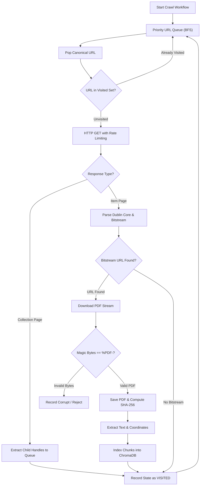

# Ingestion Architecture & Harvesting Engine

## 1. DSpace Harvester Architecture

The PolarNexus crawling engine (`crawler/`) is engineered for recursive, resumable discovery of institutional repository records:

---

## 2. Key Safeguards & Design Decisions

### 2.1 Resumable State Tracking via SQLite
Crawling large institutional repositories over satellite-backed or high-latency internet connections is prone to interruptions. The `StateManager` tracks state within `data/crawler_state.db`:
- If the crawler is terminated, it resumes seamlessly from the unvisited queue without re-downloading previously processed files.
- Command-line flag `--reset-state` allows complete cache purging when a full re-crawl is required.

### 2.2 Strict PDF Binary Validation
Many legacy DSpace installations return 200 OK responses with HTML error messages (e.g., *"Session Timeout"* or *"Access Denied"*) when a bitstream link is requested.
- `PDFDownloader` reads the first 4 bytes of every response stream.
- If the file does not start with `%PDF-` (`0x25 0x50 0x44 0x46 0x2D`), the file is immediately discarded and marked as failed.

### 2.3 Respect for Institutional Policies
- **Request Throttling**: Implements a configurable delay (default 1.0 second) between consecutive HTTP requests.
- **Concurrency Limit**: Restricts simultaneous connections to avoid imposing strain on the NCPOR production server.
- **Descriptive User-Agent**: Identifies the crawler clearly: `PolarNexus-ScientificCrawler/2.4 (+https://github.com/vijay-rodge/PolarNexus)`.
