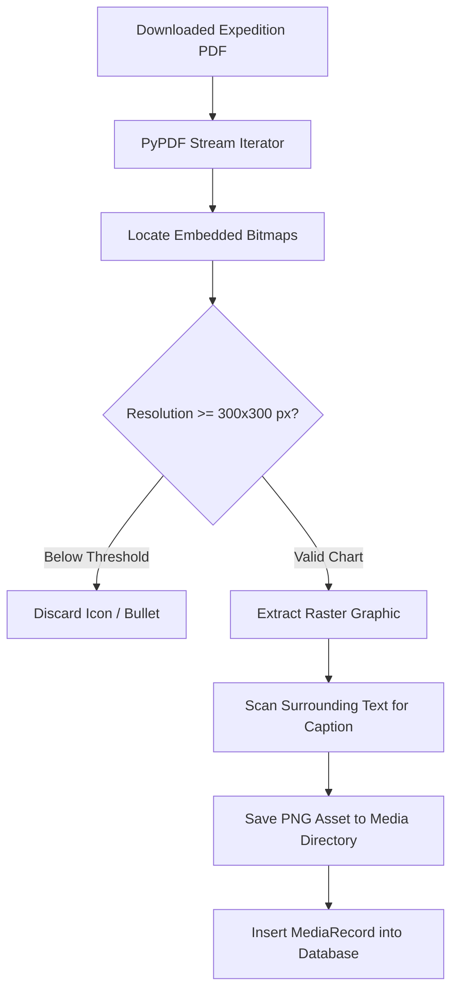

# Media Processing & Figure Extraction

## 1. Bitstream Visual Asset Extraction

Legacy scientific expedition reports contain critical visual data—including sea-ice facsimile charts, synoptic storm maps, and satellite pass geometries—embedded within PDF bitstreams. PolarNexus extracts, classifies, and indexes these figures:

---

## 2. Metadata Association & Provenance

Every extracted visual asset is indexed with complete institutional provenance:
- **`media_id`**: Cryptographic hash of image bytes.
- **`parent_item_id`**: Corresponding DSpace item identifier (e.g. `123456789/754`).
- **`caption`**: Extracted textual caption (*e.g., "Fig 1: Sea-ice facsimile chart recorded during 13th Expedition"*).
- **`page_number`**: Exact manuscript page where the chart was published.
- **`file_path`**: Local filesystem URI.
- **`checksum_sha256`**: Cryptographic hash ensuring asset integrity.
