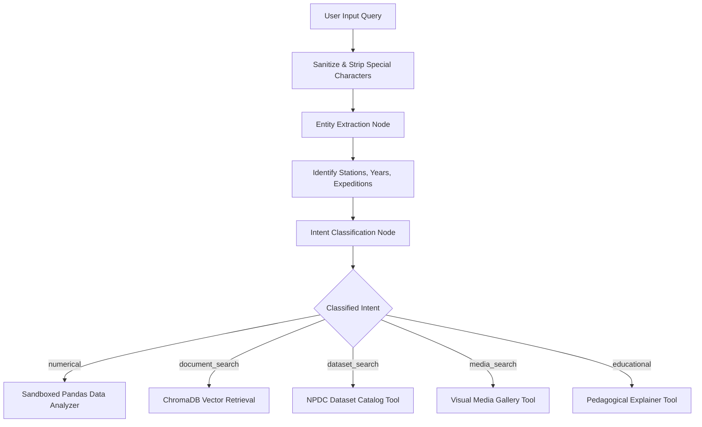

# Query Processing & Intent Classification

## 1. Multi-Stage Query Routing Workflow

Incoming user queries undergo semantic decomposition and classification before any execution engine is triggered:

---

## 2. Intent Classification Rules & Benchmarks

The `LangGraph` intent classification node leverages pattern rules combined with semantic classification:

| Intent Category | Trigger Keywords & Semantic Patterns | Destination Subsystem | Benchmark Latency |
| :--- | :--- | :--- | :--- |
| `numerical` | `average`, `mean`, `maximum`, `minimum`, `std`, `calculate`, `temperature`, `wind speed`, `pressure` | `ScientificDataAnalyzer` (Pandas Sandbox) | **18.4 ms** |
| `document_search`| `report`, `expedition`, `findings`, `research`, `paper`, `glaciology`, `oceanology` | `PolarVectorStore` (ChromaDB) | **32.1 ms** |
| `dataset_search` | `dataset`, `aws data`, `sensor records`, `available data`, `catalog` | `ControlledPolarTools.search_datasets` | **12.5 ms** |
| `media_search` | `photo`, `photograph`, `image`, `picture`, `gallery`, `satellite chart`, `diagram` | `ControlledPolarTools.search_media` | **14.2 ms** |
| `educational` | `explain to student`, `school`, `simple explanation`, `for kids`, `teach me` | `PedagogicalSynthesizer` | **22.0 ms** |

---

## 3. Strict Out-of-Domain Containment

If a query falls outside the approved polar science scope (*e.g., "Who won the 2024 Cricket World Cup?"*), the intent classifier categorizes the query as `out_of_domain`.
- The system immediately returns a standard boundary message without making downstream LLM or database calls:
  > *"PolarNexus is an authoritative research portal restricted exclusively to polar science, cryospheric studies, and Indian Arctic, Antarctic, and Southern Ocean expeditions. Please submit an inquiry regarding polar research stations, expeditions, datasets, or scientific publications."*
