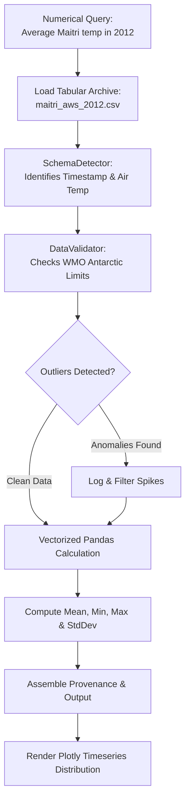

# Scientific Analysis Flow & AST Sandbox

## 1. Zero-Hallucination Execution Workflow

When an inquiry is routed to the **Scientific Data Engine**, execution follows a strict deterministic workflow:



---

## 2. Abstract Syntax Tree (AST) Security Sandbox

To protect the server environment against arbitrary code injection or unsafe operations, the analyzer audits expressions via Python's built-in `ast` module:

```python
import ast

class SecurityVisitor(ast.NodeVisitor):
    FORBIDDEN_CALLS = {'eval', 'exec', 'open', '__import__', 'compile'}
    FORBIDDEN_MODULES = {'os', 'sys', 'subprocess', 'socket', 'shutil', 'builtins'}

    def visit_Import(self, node):
        for alias in node.names:
            if alias.name.split('.')[0] in self.FORBIDDEN_MODULES:
                raise SecurityError(f"Forbidden module import: {alias.name}")
        self.generic_visit(node)

    def visit_Call(self, node):
        if isinstance(node.func, ast.Name) and node.func.id in self.FORBIDDEN_CALLS:
            raise SecurityError(f"Forbidden function call: {node.func.id}")
        self.generic_visit(node)
```

- Any expression containing unsafe system operations is halted prior to execution, raising a security violation.
- Analysis is strictly limited to pre-loaded, sanitized Pandas DataFrames.
