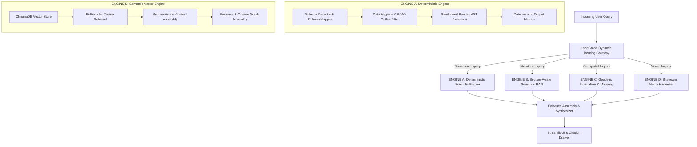

# System Architecture Overview

## 1. Architectural Philosophy: The Dual-Engine Paradigm

PolarNexus is designed to address a critical flaw found in conventional AI search systems: **the conflation of textual retrieval with scientific numerical computation**.

In standard generative architectures, all incoming user queries are processed identically: text chunks are retrieved, stuffed into an LLM context prompt, and the generative model is asked to summarize findings and calculate statistics. When applied to physical oceanography or polar meteorology, this model consistently fails. It outputs plausible-sounding mathematical figures that are completely ungrounded in real sensor measurements.

PolarNexus resolves this through an enterprise **Dual-Engine Architecture**:

---

## 2. Core Architectural Subsystems

The platform is partitioned into five loosely coupled, highly cohesive subsystems:

### 2.1 Ingestion & Harvester Subsystem (`crawler/`)
- Interacts with the live NCPOR DSpace digital repository (`http://14.139.119.23:8080/dspace/`).
- Implements breadth-first graph traversal, URL canonicalization, and deduplication via persistent SQLite state tracking (`crawler_state.db`).
- Downloads PDF bitstreams, enforces binary magic byte validation (`%PDF-`), computes SHA-256 hashes, and extracts page-by-page text.
- Extracts geodetic coordinate benchmarks and isolates visual figures.

### 2.2 Deterministic Scientific Engine (`scientific_engine/`)
- Houses the zero-hallucination mathematical execution core.
- Loads raw tabular environmental archives (e.g., Maitri Automatic Weather Station hourly datasets).
- `SchemaDetector`: Detects timestamp formats, physical parameter columns, and units.
- `DataValidator`: Rejects physically impossible outliers based on World Meteorological Organization (WMO) Antarctic standards.
- `ScientificDataAnalyzer`: Executes vectorized NumPy and Pandas calculations within an AST-audited sandbox.

### 2.3 Relational & Vector Persistence Core (`database/`, `rag/`)
- **Relational Store**: SQLAlchemy ORM models mapped to SQLite/PostgreSQL managing stations, expeditions, datasets, publications, media assets, and ingestion audit logs.
- **Vector Store**: ChromaDB (`chromadb.PersistentClient`) utilizing cosine distance with Hierarchical Navigable Small World (HNSW) indexing for semantic retrieval.

### 2.4 Multi-Agent Orchestration Gateway (`agents/`)
- Powered by a stateful **LangGraph** workflow.
- Defines a centralized `PolarState` containing the query, classified intent, extracted polar entities (station names, expedition numbers, date ranges), retrieved chunks, calculated statistics, and citation trees.

### 2.5 Presentation & Dissemination Layer (`streamlit_app/`)
- Modular multi-page Streamlit application providing interactive interfaces for research querying, dataset visualization, live DSpace harvesting, photo galleries, and pedagogical youth explainers.
- Features a custom dark-navy glassmorphic sidebar with vector SVG branding, live system telemetry, and responsive Plotly/Folium charting.
