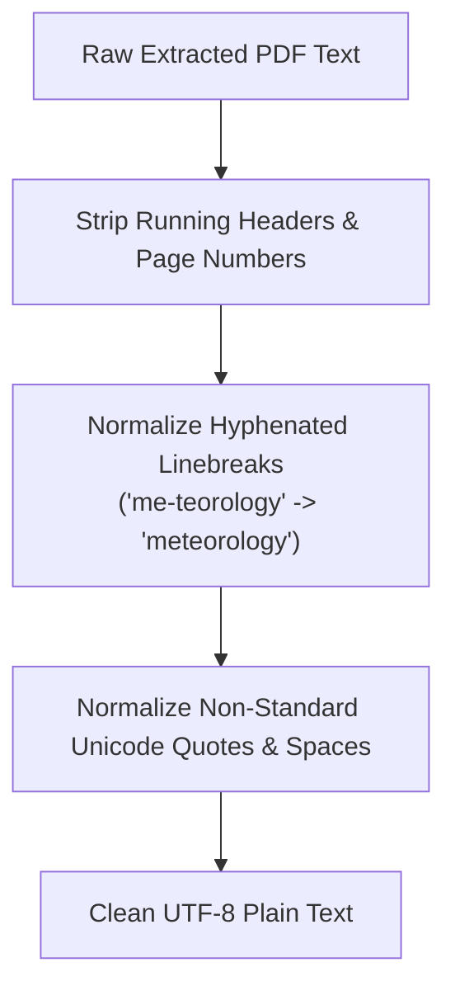

# Data Cleaning & Preprocessing

## 1. Text & Tabular Sanitization

Raw scientific data must be scrubbed of non-informational artifacts before downstream ingestion:

---

## 2. Tabular Sensor Cleaning
- **Null Value Imputation**: Missing sensor records in AWS feeds are marked with standardized IEEE NaN representations rather than misleading `-999.0` or `9999` sentinel values.
- **Time Regularization**: Timestamps are aligned to continuous 1-hour UTC intervals using Pandas `DataFrame.resample('1h')`.
