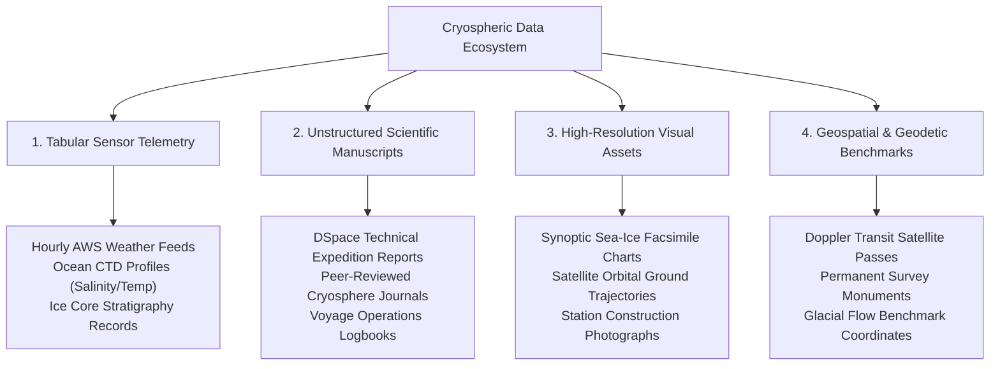

# The Cryospheric Data Ecosystem

## 1. Multi-Modal Polar Data Landscape

The Indian polar research program encompasses an exceptionally diverse array of data modalities collected across Antarctica, the Arctic, and the Southern Ocean:

---

## 2. Key Data Formats & Metadata Standards

| Data Category | Primary Formats | Governing Metadata Standard | Primary Custodian |
| :--- | :--- | :--- | :--- |
| **Meteorological Sensors** | CSV, NetCDF-4, ASCII | WMO-01 / Climate and Forecast (CF-1.8) | National Polar Data Center (NPDC) |
| **Expedition Reports** | PDF, Scanned TIFF | Dublin Core (ISO 15836) / OAI-PMH | NCPOR Digital Repository (DSpace) |
| **Geodetic Coordinates** | DMS, Decimal Degrees | WGS-84 (EPSG:4326) | Survey of India / NCPOR Geodesy |
| **Visual Media** | JPEG, PNG, GeoTIFF | EXIF / IPTC Core | NCPOR Media & Outreach Cell |
