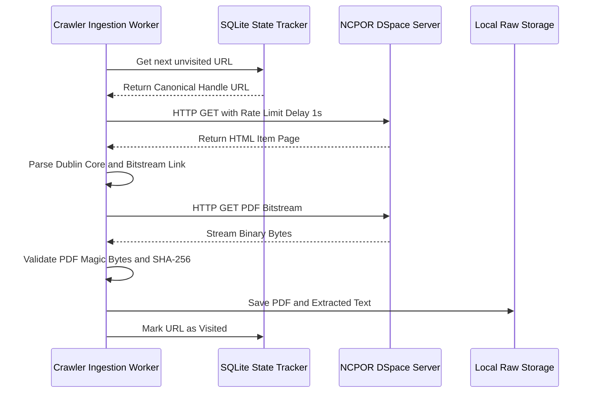

# Data Ingestion Pipeline

## 1. Ingestion Execution Flow

The ingestion pipeline executes multi-threaded, resilient harvesting across target collections:



---

## 2. Ingestion Command-Line Usage

The pipeline can be executed via the `crawler.cli` module:

```bash
# Ingest all records from DSpace starting point (Max 25 pages, Depth 4)
python -m crawler.cli --start-url http://14.139.119.23:8080/dspace/community-list --page-limit 25

# Execute live search & harvest for a specific scientific domain
python -m crawler.cli --query "oceanology"

# Reset crawler state database and re-index
python -m crawler.cli --reset-state
```
