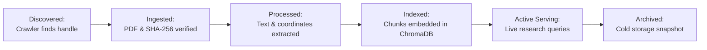

# Data Lifecycle & Retention Policies

## 1. End-to-End Lifecycle Stages

---

## 2. Cold Archival & Backup Strategies
- **Raw PDFs**: Retained permanently in `data/raw/pdfs/` with append-only access controls.
- **Extracted Text Chunks**: Versioned alongside model embeddings in `data/chunks/`.
- **Database Snapshots**: SQLite/PostgreSQL backups generated daily and archived offsite.
