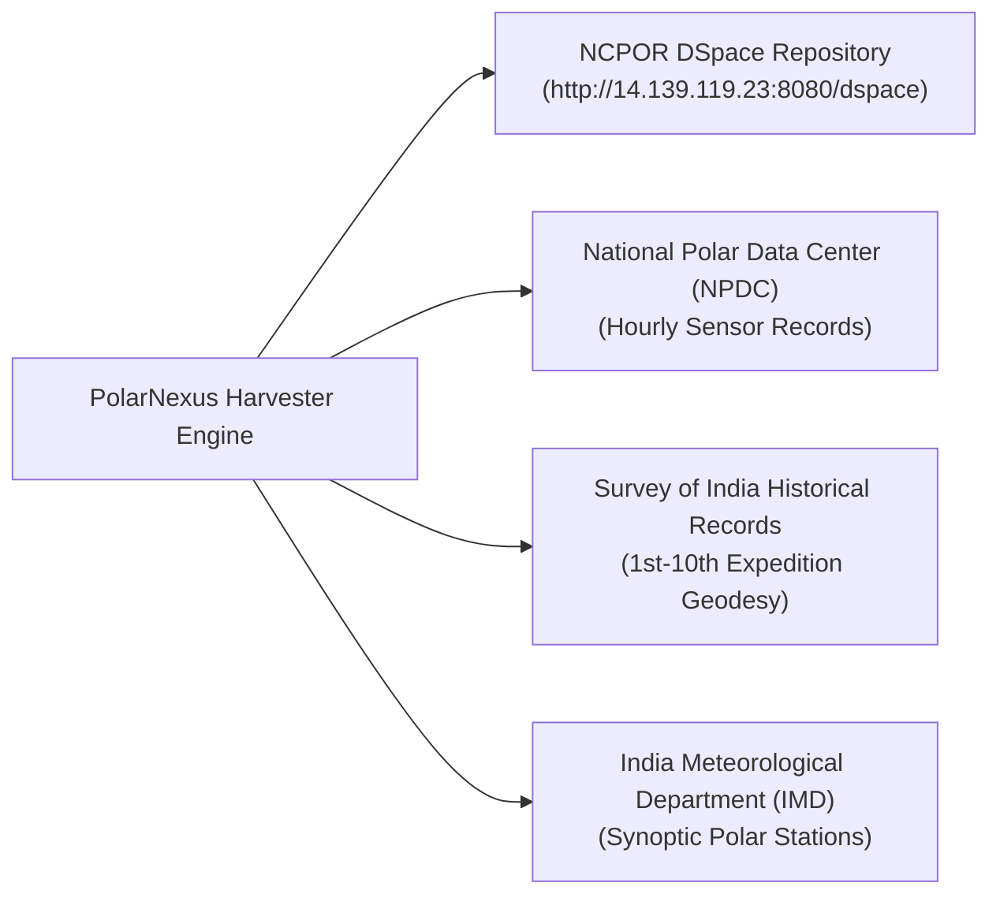

# Authoritative Data Sources

## 1. Repository Inventory

PolarNexus connects exclusively to officially sanctioned institutional data repositories:

---

## 2. Deep Dive: NCPOR DSpace Institutional Repository
- **Base Endpoint**: `http://14.139.119.23:8080/dspace/`
- **Primary Communities**:
  - `123456789/1`: Scientific Reports of Indian Expeditions to Antarctica (Expeditions 1 through 40+).
  - `123456789/2`: Arctic Research Expedition Technical Publications (Himadri & IndARC).
  - `123456789/3`: Southern Ocean / Special Expedition Monographs.
- **Access Protocol**: HTTP REST endpoints & direct HTML bitstream resolution.
