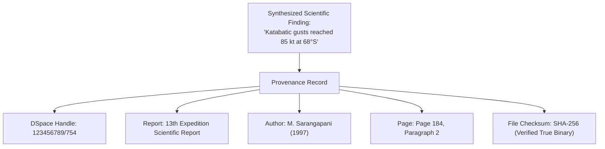

# Data Provenance & Cryptographic Audit Trails

## 1. The Necessity of Scientific Provenance

In scientific research platforms, assertions must be traceable to their empirical origins. PolarNexus generates an immutable provenance record for every insight:

---

## 2. Verification Protocol
- Every response generated by the AI Assistant displays an interactive **Citations Drawer**.
- Users can click directly on the repository handle or download the validated bitstream file to cross-examine source findings.
