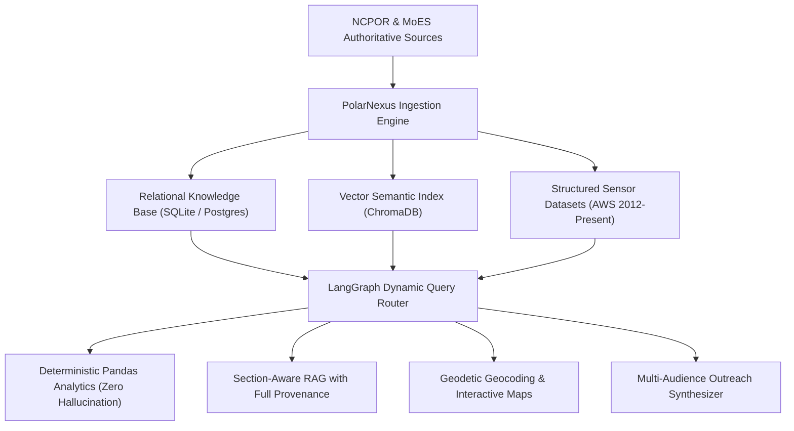

# Welcome to the PolarNexus Documentation

**PolarNexus** is an enterprise-grade, integrated polar science knowledge, discovery, analysis, and media dissemination platform developed for the **National Centre for Polar and Ocean Research (NCPOR)** and the **Ministry of Earth Sciences (MoES), Government of India**.

Developed to address **Smart India Hackathon (SIH) 2026 Problem Statement 26063**, PolarNexus unifies more than four decades of India's scientific expeditions across **Antarctica**, the **Arctic**, and the **Southern Ocean**. It transforms fragmented cryospheric research archives into an interactive, deterministic, and verifiable knowledge ecosystem.

---

## 1. Documentation Structure

This documentation is designed to serve multiple stakeholder groups—from Hackathon jury evaluators and institutional researchers to frontend engineers and open-source contributors:

| Section | Target Audience | Primary Focus |
| :--- | :--- | :--- |
| [**1. Project Overview**](/docs/overview/problem-statement) | Evaluators, Stakeholders, New Users | Problem statement, project vision, objectives, key capabilities, and impact. |
| [**2. System Architecture**](/docs/architecture/system-overview) | Software Architects, Technical Reviewers | Multi-agent LangGraph topology, pipeline data flows, sandboxed AST execution. |
| [**3. Data Ecosystem**](/docs/data/data-ecosystem) | Data Engineers, Database Admins | Ingestion pipelines, Dublin Core schemas, bitstream harvesting, provenance. |
| [**4. Knowledge Repository**](/docs/knowledge/knowledge-repository) | Polar Scientists, Domain Experts | Relational models for expeditions, permanent bases, scientific papers, and datasets. |
| [**5. Platform Experience**](/docs/platform/streamlit-application) | Frontend Developers, End Users | Streamlit modular UI, live DSpace harvester, query presets, responsive charts. |
| [**6. Scientific Data Engine**](/docs/scientific-data/overview) | Climate Researchers, Data Scientists | Pandas vectorized computation, outlier rejection, WMO physical parameter validation. |
| [**7. Media & Visualization**](/docs/media/overview) | Curators, Outreach Coordinators | High-resolution satellite charts, sea-ice facsimile isolation, photo galleries. |
| [**8. Outreach & Content**](/docs/outreach/overview) | Science Communicators, Educators | Automated generation of pedagogical school guides, press releases, social media. |
| [**9. API Reference**](/docs/api/overview) | Backend Developers, Integrators | REST endpoints, authentication protocols, JSON response contracts. |
| [**10. Security & Compliance**](/docs/security/overview) | SecOps, Infrastructure Engineers | Sandboxed Python AST execution, SQL injection defenses, role-based controls. |
| [**11. Developer Guide**](/docs/development/prerequisites) | Developers, Contributors | Local setup, virtual environments, automated testing (`pytest`), contribution guidelines. |
| [**12. Deployment & Ops**](/docs/deployment/overview) | DevOps, System Administrators | Containerization (Docker), persistent storage volumes, monitoring, backup policies. |
| [**13. Governance & Policy**](/docs/governance/data-governance) | Institutional Leads, Reviewers | Human-in-the-loop review workflows, metadata auditing, versioning policies. |

---

## 2. Dedicated Technical Blog Series

In adherence to strict architectural design standards, deep mathematical and machine learning implementations are isolated from the core user documentation and published in two dedicated engineering blog series:

- [**Polar RAG Architecture Series**](/blog): Comprehensive 16-part technical walkthrough covering document chunking strategies, embedding dimensionality, ChromaDB vector indexing, bi-encoder retrieval, citation assembly, and hallucination containment.
- [**Polar Machine Learning & Governance Series**](/blog): 16-part series detailing TF-IDF feature matrices, multinomial domain classifiers, K-Means cryospheric clustering, model serialization, and audit logging.

---

## 3. Core Architectural Principles

1. **Zero Hallucination for Scientific Data**: All numerical inquiries (*e.g., "What was the average wind speed at Maitri in June 2012?"*) are routed away from generative models and executed deterministically by a sandboxed Pandas analytics engine over verified NetCDF/CSV tabular archives.
2. **Authoritative Provenance**: Every text summary, coordinate benchmark, and photographic asset links directly to its source manuscript handle on the official NCPOR DSpace repository (`http://14.139.119.23:8080/dspace/`).
3. **Geodetic Precision**: Historical Antarctic survey coordinates (often obscured by OCR errors in legacy scan reports) are parsed and normalized into standardized WGS-84 decimal and DMS coordinates.
4. **Pedagogical Adaptation**: Translates complex glaciological monographs into tailored outputs for primary school students, college researchers, and press journalists while maintaining strict factual grounding.
