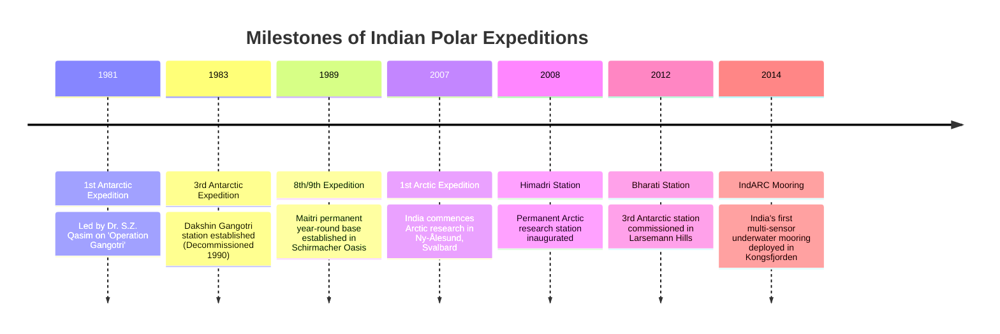

# Indian Polar Expeditions

## 1. Historical Chronology

Since December 1981, India has organized:
- **43+ Antarctic Expeditions**: Operating continuously from Dakshin Gangotri (1983) to Maitri (1989) and Bharati (2012).
- **16+ Arctic Expeditions**: Initiated in 2007, operating seasonal atmospheric and marine research at Himadri and IndARC.
- **12+ Southern Ocean Expeditions**: Dedicated oceanographic cruises on the *ORV Sagar Kanya* studying biogeochemical cycles between 40°S and 65°S.

