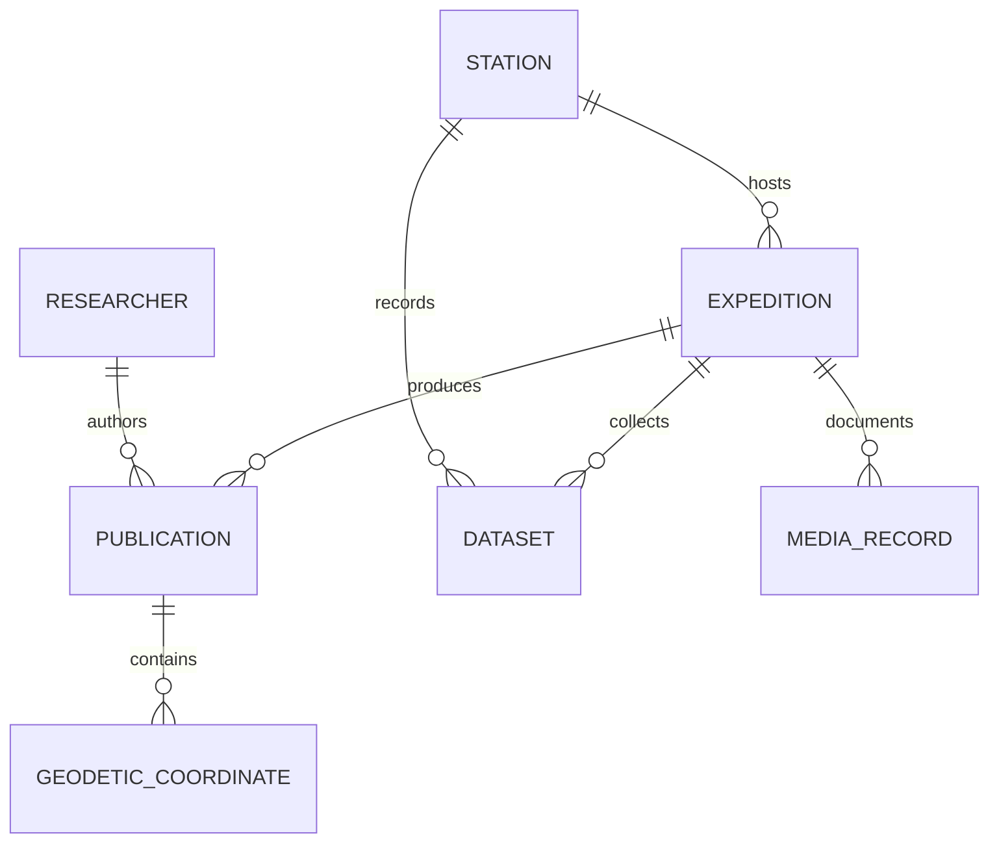

# Knowledge Repository Architecture

## 1. Conceptual Knowledge Graph

The PolarNexus Knowledge Repository connects fragmented institutional entities into an integrated relational graph:



---

## 2. Core Relational Schema

```sql
CREATE TABLE stations (
    id INTEGER PRIMARY KEY,
    name TEXT NOT NULL,
    region TEXT NOT NULL,
    latitude REAL NOT NULL,
    longitude REAL NOT NULL,
    elevation_m REAL,
    established_year INTEGER,
    status TEXT NOT NULL
);

CREATE TABLE expeditions (
    id INTEGER PRIMARY KEY,
    expedition_number INTEGER NOT NULL,
    season TEXT NOT NULL,
    leader_name TEXT,
    vessel_name TEXT,
    primary_station_id INTEGER REFERENCES stations(id)
);

CREATE TABLE publications (
    id INTEGER PRIMARY KEY,
    item_id TEXT UNIQUE NOT NULL,
    title TEXT NOT NULL,
    authors TEXT,
    issue_date TEXT,
    handle_url TEXT,
    primary_pdf_url TEXT,
    sha256 TEXT
);
```
