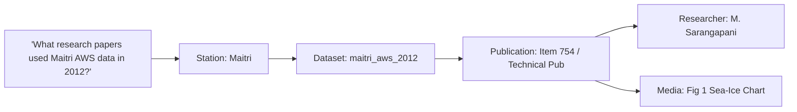

# Entity Relationships & Discovery Graph

## 1. Graph Traversal for Discovery

By modeling entities relationally, users can execute multi-hop queries that were previously impossible across disconnected portals:

This interconnected graph structure is what transforms PolarNexus from a simple search engine into an intelligent polar knowledge discovery engine.
