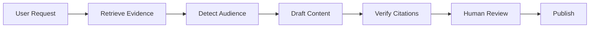

# Content Generation Workflow

## 1. The Generation-to-Dissemination Pipeline

```mermaid
flowchart LR
    A["User Request"] --> B["Retrieve Evidence"]
    B --> C["Detect Audience"]
    C --> D["Draft Content"]
    D --> E["Verify Citations"]
    E --> F["Human Review"]
    F --> G["Publish"]
```
