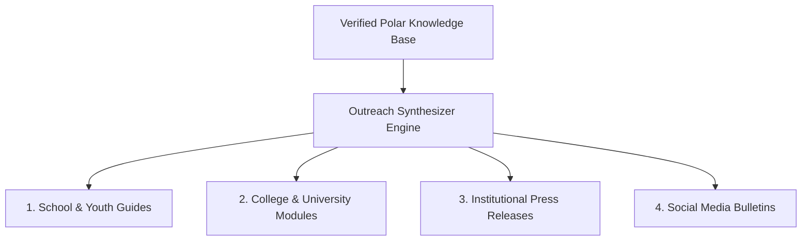

# Outreach & Content Generation Overview

## 1. Translating Polar Science for Society

The PolarNexus Outreach Engine converts dense scientific literature into accessible, engaging pedagogical content tailored for distinct societal audiences:

