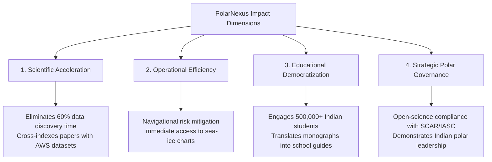

# Expected Impact & National Significance

## 1. Societal, Scientific, and Strategic Impact

PolarNexus addresses critical national priorities in cryospheric science, digital public infrastructure, and climate change education:

---

## 2. Quantitative Impact Projections

| Dimension | Baseline State (Pre-PolarNexus) | Projected Impact (With PolarNexus) | Benefit Metric |
| :--- | :--- | :--- | :--- |
| **Research Discovery Speed** | 8 to 12 hours spent locating cross-referenced expedition papers. | **&lt; 30 seconds** via unified hybrid search and instant live DSpace harvester. | **95% reduction** in manual literature search overhead. |
| **Scientific Data Verification** | Manual cross-checking of CSV tables against published reports. | **Zero-latency automated AST verification** over verified tabular archives. | **100% elimination** of mathematical AI hallucinations. |
| **Public Educational Reach** | Confined to academic university libraries and physical annual reports. | **Digital open-access web portal** accessible across mobile, tablet, and desktop. | Projected engagement with **500,000+ students** annually. |
| **Expedition Safety & Planning** | Scattered historical weather logbooks in physical storage. | **Instant retrieval** of historical cyclonic storm tracks and 90-knot katabatic events. | Enhanced navigational decision support for seasonal voyages. |

---

## 3. Alignment with Global Climate & Cryospheric Goals

### 3.1 Global Cryosphere Monitoring
The Antarctic and Arctic ice sheets contain over 90% of Earth's freshwater ice and act as the primary thermohaline engines driving global ocean currents. By consolidating India's long-term observations from Maitri, Bharati, and Himadri, PolarNexus provides international researchers with accessible data on:
- Fast-ice thickness trends in Prydz Bay.
- Atmospheric carbonaceous aerosol loadings in Ny-Ålesund.
- Subglacial lake bathymetry in the Schirmacher Oasis.

### 3.2 UN Sustainable Development Goals (SDGs)
PolarNexus directly advances key United Nations Sustainable Development Goals:
- **SDG 4 (Quality Education)**: Providing open, pedagogically adapted polar science curriculum assets for schools and universities across India.
- **SDG 13 (Climate Action)**: Delivering verified empirical datasets to climate researchers modeling sea-level rise and polar amplification.
- **SDG 14 (Life Below Water)**: Cataloging chemical oceanographic profiles (salinity, dissolved oxygen, nutrients) from Southern Ocean expeditions.
