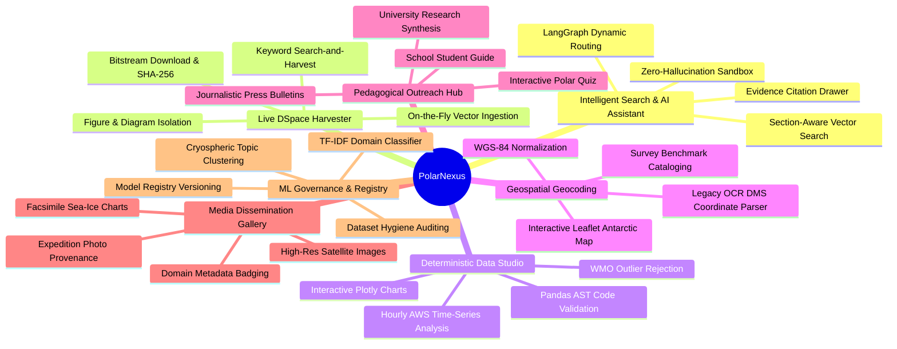

# Key Features & Platform Capabilities

## 1. Feature Matrix Overview

PolarNexus provides seven foundational capability pillars, engineered specifically to satisfy modern research, operational, and pedagogical demands:

---

## 2. In-Depth Pillar Breakdown

### 2.1 Live DSpace Simple-Search & Automated Pipeline
- **Real-Time Harvesting**: Queries `http://14.139.119.23:8080/dspace/simple-search` dynamically.
- **Bitstream Verification**: Validates `%PDF-` magic bytes and ensures downloaded files are true binaries rather than HTML error pages.
- **On-the-Fly Chunking**: Chunks text page-by-page, generates metadata provenance entries, and immediately upserts vectors into ChromaDB for instant querying.
- **Systematic Loop**: When multiple documents match a query (e.g., items `281` and `754` for *oceanology*), each manuscript is processed independently and synthesized into a deep, multi-paragraph report.

### 2.2 Deterministic Scientific Computing Engine
- **Sandboxed Execution**: Executes Pandas operations in an isolated AST-verified environment.
- **Physical Boundary Validation**: Automatically flags or removes impossible sensor readings (e.g., negative wind speeds or temperatures exceeding +30°C in inland Antarctica).
- **Time-Series Aggregation**: Computes diurnal, monthly, and seasonal averages, standard deviations, and extremes with verified timestamp alignment.

### 2.3 Historical Coordinate Geocoder & Interactive Mapping
- **Optical Typos Correction**: Fixes OCR substitutions in legacy expedition reports from the 1980s (e.g., correcting `70°45'O9" S` to `70°45'09" S`).
- **Cartographic Visualisation**: Renders interactive Leaflet/Folium maps highlighting station coordinates, expedition route waypoints, and survey benchmarks.

### 2.4 Section-Aware RAG with Full Provenance
- **Context Preservation**: Retains document hierarchy (Expedition Number -> Report Title -> Section Name -> Page Number).
- **Interactive Citation Drawer**: Every response displays an expandable drawer listing exact document titles, author names, DSpace handles, and local file hashes.

### 2.5 Multi-Tier Pedagogical Content Generator
- **Adaptive Synthesis**: Tailors complex scientific monographs into three calibrated pedagogical tiers (School, University, Press).
- **Factual Grounding**: Outlines scientific facts without exaggerations or sensationalism, strictly adhering to source manuscripts.

### 2.6 ML Governance & Model Registry
- **TF-IDF Domain Classifier**: Automatically categorizes unclassified manuscripts into scientific disciplines (*Meteorology, Glaciology, Oceanography, Geodesy, Biology*).
- **Model Versioning**: Persists trained models with full metadata logging (training date, hyperparameter settings, F1-scores) in `data/metadata/models/model_registry.json`.

---

## 3. Comparison with Conventional Approaches

| Capability | Generic Search / Standard Portals | Standalone Generative AI (LLMs) | PolarNexus Integrated Platform |
| :--- | :--- | :--- | :--- |
| **Numerical Accuracy** | Limited to static pre-computed tables | Hallucinates mathematical averages | **100% Deterministic (Pandas AST Sandbox)** |
| **Document Discovery** | Exact keyword matching only | Broad summaries without citations | **Hybrid Semantic + Exact Keyword Search** |
| **Data Provenance** | None or broken hyperlinks | Hallucinated URLs and citations | **Complete DSpace Handle & SHA-256 Audit Trail** |
| **Geospatial Mapping** | Manual coordinate entry | Cannot parse scanned coordinates | **Automated Geodetic Extraction & Normalization** |
| **Pedagogical Reach** | Dense 400-page academic PDFs | Generic, over-simplified text | **Multi-Audience Adaptive Synthesis** |
