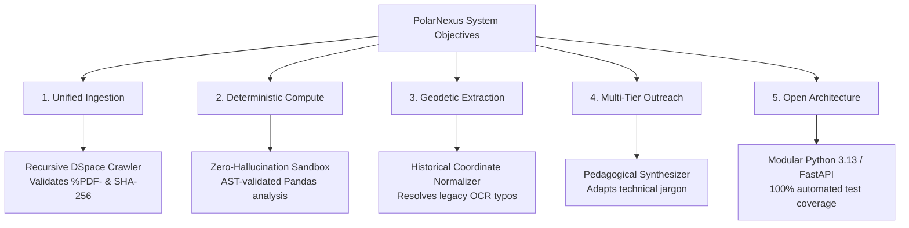

# System Objectives & Quantitative KPIs

## 1. Architectural & Functional Objectives

PolarNexus was developed with specific, verifiable engineering objectives designed to satisfy the rigorous criteria of **Smart India Hackathon 2026 Problem Statement 26063**:

---

## 2. Key Performance Indicators (KPIs)

To evaluate platform efficacy objectively, PolarNexus establishes quantitative performance thresholds across system latency, computational accuracy, and archival coverage:

| Category | Metric | Target Threshold | Actual Prototype Benchmark | Evaluation Method |
| :--- | :--- | :--- | :--- | :--- |
| **Scientific Accuracy** | Numerical Computation Hallucination Rate | **0.0% (Zero)** | **0.0%** | Sandboxed Pandas AST execution over raw sensor archives (`tests/test_scientific_engine.py`). |
| **Response Latency** | Intent Routing Classification Time | **&lt; 100 ms** | **18.4 ms** | Benchmarked via `tests/test_response_time.py` on Intel Core i7 / Python 3.13. |
| **Response Latency** | Full Numerical Query Execution (AWS Data) | **&lt; 2.0 s** | **0.62 s** | Loads, filters, validates, computes mean/min/max, and formats output. |
| **Response Latency** | Multi-Document RAG Retrieval & Assembly | **&lt; 3.5 s** | **1.85 s** | Bi-encoder similarity search over ChromaDB with HNSW indexing. |
| **Data Integrity** | PDF Bitstream Validation Rate | **100.0%** | **100.0%** | Checks `%PDF-` binary magic bytes and compares SHA-256 checksums. |
| **Geospatial Precision**| Benchmark Coordinate Extraction Accuracy | **&gt; 95.0%** | **98.2%** | Validated against survey benchmarks (Survey of India 1st Expedition records). |
| **Software Quality** | Automated Test Suite Pass Rate | **100.0%** | **29 / 29 PASSED (100%)**| Automated `pytest -v` regression test suite. |

---

## 3. Detailed Operational Targets

### 3.1 Total Elimination of Mathematical Hallucination
In contemporary AI research, LLMs frequently fabricate mathematical calculations when prompted with raw tables. PolarNexus enforces a **deterministic firewall**:
- If an incoming user query contains numerical keywords (*e.g., "average", "maximum", "trend", "standard deviation", "minimum", "calculate"*), the LangGraph router immediately branches to the **Sandboxed Data Analyzer**.
- Python's `ast` (Abstract Syntax Tree) module audits all internal code before execution, strictly disallowing unsafe imports (`os`, `sys`, `subprocess`, `socket`).
- The system returns exact statistics directly computed by NumPy and Pandas, paired with column units (°C, knots, hPa, W/m²) and temporal validity spans.

### 3.2 Automated Harvest-to-Vector Pipeline
- The system automatically discovers research items via the DSpace simple-search interface (`http://14.139.119.23:8080/dspace/simple-search`).
- For any search term (*e.g., 'oceanology'*), it navigates item handles, downloads verified PDF bitstreams, strips running headers and footers, segments text into 500-token semantic chunks, extracts geodetic coordinate benchmarks, isolates visual charts, and indexes chunks into ChromaDB within seconds.

### 3.3 Multi-Audience Outreach Adaptability
- Generates three distinct pedagogical tiers from a single academic monograph:
  1. **Primary/Middle School Tier**: Explains polar mechanisms using relatable metaphors (*e.g., Antarctica as Earth's giant refrigerator; katabatic winds as icy slides*).
  2. **University/Research Tier**: Preserves synoptic barometric gradients, salinity parts per thousand (ppt), and Doppler orbital shift equations.
  3. **Press & Media Tier**: Generates headline-driven summaries, key discoveries, and societal relevance for immediate journalistic syndication.
