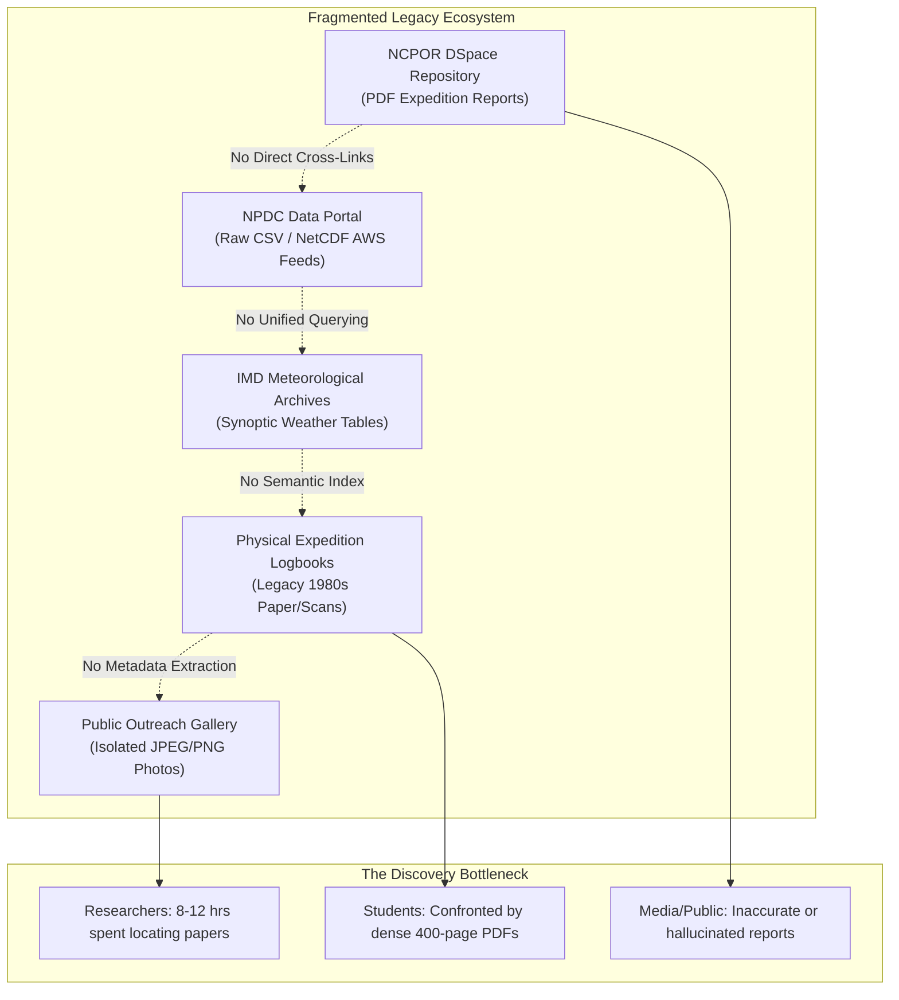
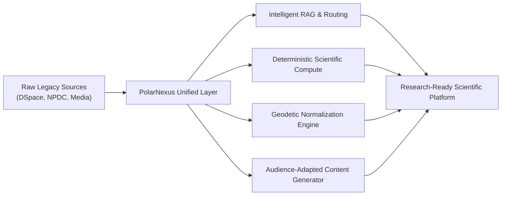

# Problem Statement & Scientific Context

## 1. Executive Summary

Since the launch of the First Indian Scientific Expedition to Antarctica in 1981, India has maintained a continuous, highly productive presence in the polar regions. Led by the **National Centre for Polar and Ocean Research (NCPOR)** under the **Ministry of Earth Sciences (MoES)**, India operates year-round research stations in Antarctica (**Maitri**, **Bharati**) and seasonal bases in the Arctic (**Himadri**, **IndARC underwater mooring**), complemented by deep-ocean research vessels like the *ORV Sagar Kanya* and *RV Bharati*.

Over four decades of scientific activity, India has accumulated tens of thousands of scientific publications, expedition technical reports, high-frequency Automatic Weather Station (AWS) telemetry archives, satellite orbital passes, photographic collections, and sediment core catalogues.

However, despite the immense scientific value of these assets, accessibility remains severely hampered by digital fragmentation, heterogeneous metadata schemas, legacy archival formats, and the lack of an intelligent discovery and synthesis layer. **Smart India Hackathon (SIH) 2026 Problem Statement 26063** directly addresses this national challenge: creating an **Integrated Polar Science Outreach, Knowledge Repository, and Media Dissemination Portal**.

---

## 2. Analysis of Information Fragmentation

The primary impediment to polar science discovery in India is not the absence of data, but rather its dispersion across disparate, non-interoperable institutional systems:

### 2.1 Disconnected Institutional Repositories
- **Digital Repositories (DSpace)**: NCPOR hosts a digital repository (`http://14.139.119.23:8080/dspace/`) holding technical expedition reports and journal manuscripts. However, search is restricted to basic keyword matching against Dublin Core metadata strings, completely unable to search within tabular findings, geographical coordinates, or embedded figures.
- **National Polar Data Center (NPDC)**: The NPDC catalogs raw environmental sensor datasets (e.g., Maitri AWS 2012 hourly observations, CTD profiles, ozone sonde soundings). These datasets exist in tabular CSV, NetCDF, or ASCII formats, completely decoupled from the scientific papers that interpret them.
- **Visual Assets & Media**: Photographic archives, voyage track charts, and satellite orbit maps are stored in isolated file systems without standardized EXIF metadata, geospatial tags, or links to corresponding expedition numbers.

### 2.2 The Legacy Scan & OCR Dilemma
Indian expeditions from the 1980s and 1990s (Expeditions 1 through 15) produced comprehensive Scientific Reports printed on manual typewriters or early word processors. When digitized into PDF format, legacy OCR engines frequently corrupted geodetic coordinates, station names, and tabular numerical data:
- Benchmark latitudes such as `70°45'57" S` were scanned as `70045'57" S` or `70°4S'S7" S`.
- Sub-zero air temperatures (e.g., `-28.4 °C`) lost minus signs or converted hyphen characters into unparseable binary symbols.
- Critical satellite doppler tracking tables (Transit Navy Navigational Satellite System) remained trapped as non-searchable raster images.

### 2.3 The Semantic Gap for Diverse Stakeholders

| Stakeholder Persona | Core Challenge | Consequence |
| :--- | :--- | :--- |
| **Cryospheric Researcher** | Cannot cross-reference raw meteorological anomalies with published glaciological papers. | Duplicate research initiatives, wasted grant funding, 60% time spent on data wrangling. |
| **Operations & Logistics Director** | Difficult to query historical sea-ice conditions or katabatic wind frequencies for planning seasonal voyages. | Heightened navigational risk during ice-shelf approach and ship berthing at India Bay. |
| **School & College Student** | Confronted by 300-page academic monographs filled with dense physical oceanography jargon. | Low public engagement, diminished interest in polar science careers. |
| **Science Journalist** | Relies on generic LLMs that hallucinate facts regarding station decommissioning dates or temperature records. | Dissemination of inaccurate scientific claims in mainstream media. |

---

## 3. The Generative AI Hazard: Hallucination in Scientific Computing

When conventional generative AI models (such as standalone ChatGPT or Gemini) are queried with factual scientific inquiries:
> *"What was the average air temperature recorded at Maitri Station during June 2012?"*

Generative models attempt to predict the most statistically probable string of numbers rather than performing deterministic mathematical calculations over raw sensor records. The model might plausibly output `-14.2 °C` when the actual sensor mean computed from 720 hourly AWS records was `-18.7 °C`. In scientific research, **statistical hallucination is catastrophic**.

PolarNexus eliminates this hazard through a **bifurcated architectural paradigm**:
1. **Unstructured Knowledge**: Handled via vector embeddings, section-aware semantic chunking, and strict citation enforcement.
2. **Structured Numerical Telemetry**: Handled exclusively by a **Sandboxed Deterministic Pandas Analytical Engine** that writes zero code guesses, validating units, date ranges, and physical limits before outputting results.

---

## 4. The Mandate for PolarNexus

PolarNexus is engineered not to replace NCPOR's authoritative data vaults, but to serve as the **intelligent unified discovery, verification, and dissemination fabric** over them:

By resolving the four decades of data fragmentation, PolarNexus delivers an open-science platform for India's scientific community, aligned with national objectives in cryospheric research, climate resilience, and public scientific literacy.
