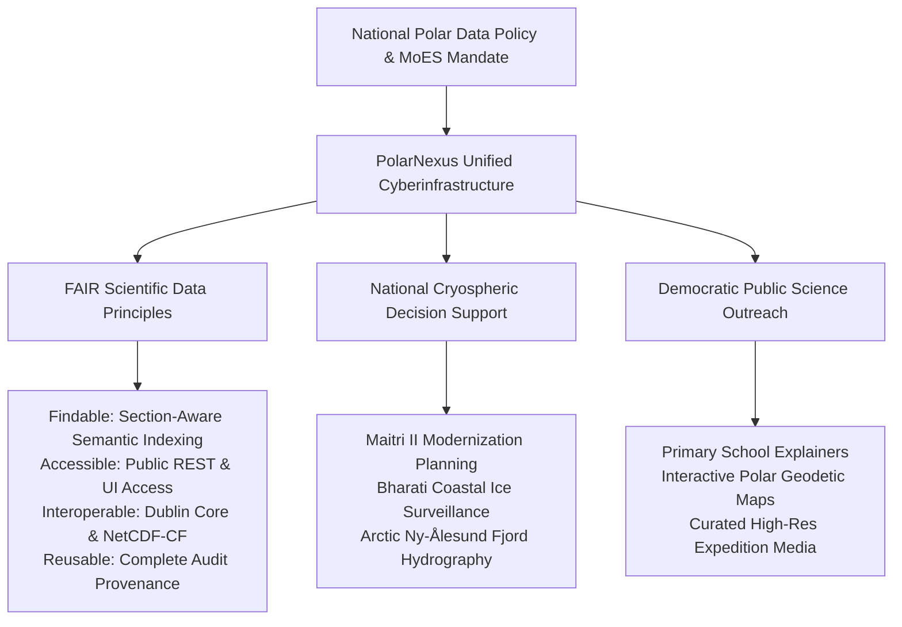
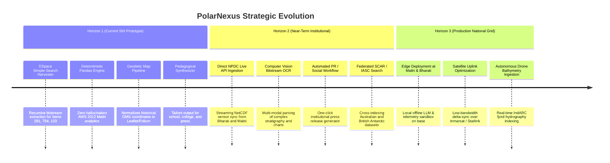

# Project Vision & Strategic Roadmap

## 1. High-Level Vision Statement

**PolarNexus** envisions transforming India's polar science assets into a globally accessible, scientifically rigorous, and pedagogically transformative digital commons. By integrating high-frequency cryospheric telemetry, historical expedition manuscripts, satellite remote sensing imagery, and state-of-the-art multi-agent AI routing, PolarNexus positions India at the forefront of international polar cyberinfrastructure.

---

## 2. Alignment with India's National Polar Policy

In 2022, the Ministry of Earth Sciences unveiled India's comprehensive Arctic and Antarctic strategic frameworks, highlighting:
1. **Enhanced Scientific Research**: Bolstering long-term observation systems monitoring the Antarctic ozone hole, sea-ice extent anomalies, and microbial genomics in subglacial lakes.
2. **Data Digitization and Open Science**: Mandating that all tax-payer funded polar expeditions provide public, machine-readable datasets adhering to international WMO, SCAR (Scientific Committee on Antarctic Research), and IASC (International Arctic Science Committee) metadata standards.
3. **National Capacity Building**: Fostering polar science awareness across Indian universities, schools, and research institutions to cultivate the next generation of polar scientists, glaciologists, and oceanographers.

PolarNexus serves as the direct technological realization of these national directives, converting static data silos into an active, interactive intelligence layer.

---

## 3. The FAIR Data Foundation

PolarNexus implements the internationally acclaimed **FAIR** data principles across every ingested asset:

| Principle | Implementation in PolarNexus | Verification Mechanism |
| :--- | :--- | :--- |
| **Findability** | Every expedition report, AWS dataset, and media item receives a unique URI and persistent DSpace Handle (`123456789/xxx`). Metadata is indexed in Dublin Core and ChromaDB vector space. | Instant hybrid search (keyword + vector similarity) with sub-second retrieval latency. |
| **Accessibility** | Open HTTP/REST APIs and Streamlit web portals enable direct querying without authentication barriers for public scientific assets. | Standard JSON-REST endpoints, downloadable CSVs, and direct bitstream download hyperlinks. |
| **Interoperability** | Tabular observations adhere to NetCDF-CF and WMO-01 conventions; textual documents adhere to Dublin Core (ISO 15836); geodetic coordinates adhere to WGS-84 (EPSG:4326). | SchemaDetector auto-identifies units (°C, m/s, hPa) and converts historical DMS formats to decimal latitude/longitude. |
| **Reusability** | Every data point retains complete provenance: original author, expedition year, station name, file size, SHA-256 hash, and extraction timestamps. | Citations drawer displays exact parent report, page numbers, and repository URLs for every generated insight. |

---

## 4. Multi-Year Strategic Roadmap

The architectural evolution of PolarNexus is structured across three planned development horizons:

