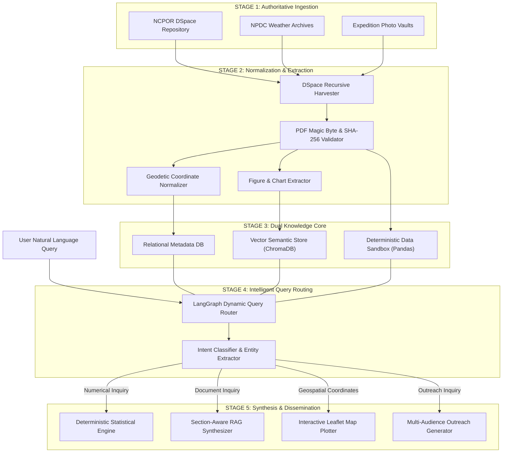

# Complete Solution Architecture & End-to-End Flow

## 1. High-Level Architectural Flow

PolarNexus operates as an interconnected, multi-stage intelligence fabric that transforms raw, heterogeneous polar research repositories into validated scientific insights, interactive geospatial visualisations, and pedagogical outreach assets:



---

## 2. Walkthrough of the 10 Pipeline Stages

### Stage 1: Authoritative Acquisition
- Connects directly to NCPOR's live repositories over HTTP/REST protocols.
- Respects robots.txt policies, employs configurable request throttling (default 1.0s delay), and user-agent self-identification.
- Implements exponential backoff retries (maximum 3 retries) with session keep-alives.

### Stage 2: Bitstream Sanitization & Validation
- Validates the initial 4 bytes of every downloaded file to confirm the `%PDF-` file magic signature.
- Rejects HTML error pages masquerading with `.pdf` extensions.
- Computes cryptographic SHA-256 checksums to detect duplicate manuscripts and maintain byte-level provenance.

### Stage 3: Geodetic Geocoding & Coordinate Normalization
- Scans legacy OCR text for historical navigational coordinate notations (*e.g., `70°45'57" S, 11°44'09" E`*).
- Corrects common optical character recognition anomalies (*e.g., converting capital letter `O` or `S` in numeric fields back to digits*).
- Outputs standardized decimal latitude/longitude pairs and WGS-84 coordinate tuples for immediate mapping.

### Stage 4: Semantic Chunking & Vector Ingestion
- Cleans running document headers, footers, and page numbers.
- Deconstructs multi-page expedition reports into section-aware semantic chunks (average 500 tokens with 50-token overlap).
- Embedds chunks into a high-dimensional vector space stored within a persistent ChromaDB instance (`PolarVectorStore`).

### Stage 5: Deterministic Numerical Engine Ingestion
- Pre-indexes tabular datasets from Automatic Weather Stations (AWS) covering Maitri, Bharati, and Himadri.
- Scans data schemas via `SchemaDetector` to identify timestamp columns, temperature columns, wind speed vectors, and barometric pressures.
- Executes statistical outlier sanitation using WMO-recommended physical limits (e.g., filtering impossible Antarctic temperatures outside -90°C to +20°C).

### Stage 6: LangGraph Query Orchestration
- When a user submits an inquiry, LangGraph evaluates the input string through an **Intent Classification Node**:
  - `intent == 'numerical'`: Routes to Sandboxed Pandas Engine.
  - `intent == 'document_search'`: Routes to ChromaDB Vector Retrieval.
  - `intent == 'dataset_search'`: Routes to NPDC Dataset Catalog.
  - `intent == 'media_search'`: Routes to Visual Asset Gallery.
  - `intent == 'educational'`: Routes to Pedagogical Explainer Engine.

### Stage 7: Sandboxed Mathematical Execution
- If numerical, the engine isolates relevant time-series subsets via Pandas.
- Executes operations deterministically:
  ```text
mu = (1 / N) * sum(x_i),  sigma = sqrt((1 / (N - 1)) * sum((x_i - mu)^2))
```
- Completely bypasses LLM generative speculation, eliminating math hallucinations.

### Stage 8: Evidence Assembly & Citation Graph
- Gathers retrieved text chunks, computed numerical metrics, and geolocated coordinates into an **Evidence Assembly Object**.
- Attaches persistent DSpace URLs, expedition report titles, author names, and publication years to every assertion.

### Stage 9: Natural Language Synthesis
- Formats the consolidated evidence into structured scientific Markdown:
  1. Executive Findings
  2. Quantitative Summary
  3. Meteorological & Cryospheric Dynamics
  4. Repository Provenance Table
  5. Interactive Geospatial Map
  6. Extracted Scientific Diagrams

### Stage 10: Human Review & Outreach Dissemination
- Outreach officers can export verified drafts directly to educational school modules, institutional press releases, or social media bulletins with a single click.
