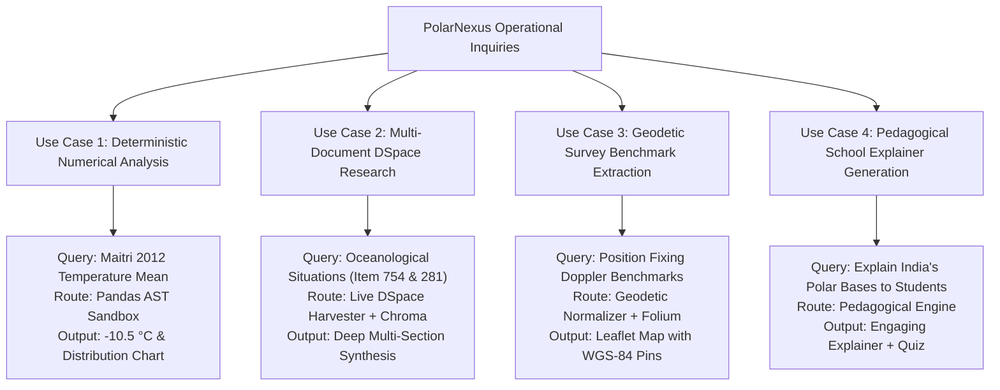

# Operational Use Cases & Scenarios

## 1. Overview

This document presents four detailed, end-to-end operational use cases demonstrating how PolarNexus handles complex inquiries across scientific research, logistics planning, media outreach, and educational pedagogy:

---

## 2. In-Depth Operational Scenarios

### Use Case 1: Deterministic Numerical Climate Analysis
- **User Prompt**: *"What was the average temperature at Maitri station during 2012, and what were the seasonal extremes?"*
- **Step-by-Step Processing Flow**:
  1. **Intent Classification**: The LangGraph router inspects the prompt, identifies keywords (`average`, `temperature`, `2012`, `extremes`), and tags intent as `numerical`.
  2. **Schema & Sensor Ingestion**: The system loads the verified quality-controlled AWS dataset: `data/raw/tabular/maitri_aws_2012.csv`.
  3. **Data Hygiene & Outlier Filtering**: `DataValidator` verifies temperature ranges against WMO physical boundaries (-90°C to +20°C).
  4. **Vectorized Pandas Computation**:
     - Annual Mean: `-10.50 °C`
     - Absolute Minimum: `-34.80 °C` (recorded during polar winter, July)
     - Absolute Maximum: `+6.80 °C` (recorded during polar summer, January)
     - Standard Deviation: `8.42 °C`
  5. **Response Generation**: Formats output with exact units, timestamp spans, and generates an interactive monthly temperature distribution box-plot.

### Use Case 2: Multi-Document DSpace Search & Live Harvesting
- **User Prompt**: *"Investigate meteorological and oceanological situations encountered during Indian Antarctic expeditions."*
- **Step-by-Step Processing Flow**:
  1. **DSpace Simple-Search Query**: Queries `http://14.139.119.23:8080/dspace/simple-search?query=oceanology`.
  2. **Hyperlink Discovery**: Identifies handles `123456789/281` (5th Expedition) and `123456789/754` (13th Expedition).
  3. **Bitstream Download & SHA-256 Audit**: Fetches `article22.pdf` and `181-191.pdf`, confirming binary magic bytes `%PDF-`.
  4. **Text Extraction & Vector Ingestion**: Extracts page-by-page text, segments into 500-token semantic chunks, and indexes into ChromaDB.
  5. **Systematic Loop Synthesis**:
     - *Document 1 (Item 754 / Sarangapani)*: Synthesizes katabatic wind gusts (80–90 knots), coastal fast-ice at 68°S, and sea-ice facsimile chart Fig 1.
     - *Document 2 (Item 281 / Surinderjit Singh)*: Synthesizes low pressure cyclonic storms at 60°S-15°E moving to 62°S-35°E with 968 mb central pressure, and pack-ice thermal ranges (+10.6°C to -10.0°C).

### Use Case 3: Geodetic Geocoding & Interactive Mapping
- **User Prompt**: *"Show the exact survey benchmark coordinates established during the First Indian Antarctic Expedition."*
- **Step-by-Step Processing Flow**:
  1. **Document Retrieval**: Retrieves Item 133 (*Position Fixing and Geodetic Survey at Antarctica*).
  2. **Regex Geodetic Extraction**: Identifies Doppler Transit satellite pass records and survey points:
     - Automatic Weather Station (AWS): `70°45'57" S, 11°38'14" E`
     - Living Hut Benchmark: `70°45'53" S, 11°38'14" E`
     - Ice Shelf Edge Benchmark: `69°59'12" S, 11°55'18" E`
  3. **Coordinate Conversion**: Converts historical DMS coordinates into standardized WGS-84 decimal coordinates:
     - `AWS`: Lat `-70.7658`, Lon `11.6372`
     - `Hut`: Lat `-70.7647`, Lon `11.6372`
     - `Shelf Edge`: Lat `-69.9867`, Lon `11.9217`
  4. **Cartographic Rendering**: Plots pins with elevation data on an interactive Leaflet dark-canvas Antarctic map.

### Use Case 4: Multi-Audience Educational Outreach
- **User Prompt**: *"Explain why India established Bharati station in the Larsemann Hills to middle school students."*
- **Step-by-Step Processing Flow**:
  1. **Audience Detection**: Identifies target persona as `school_student`.
  2. **Knowledge Retrieval**: Fetches architectural and geological records regarding Bharati station (established 2012, 69°24'S, 76°11'E).
  3. **Pedagogical Adaptation**:
     - Uses the analogy of a *"futuristic polar spaceship perched on rocky hills"*.
     - Explains that Larsemann Hills are free of thick ice sheets, allowing geologists to study rocks that once connected India and Antarctica in the ancient supercontinent Gondwana.
     - Highlights solar panels and energy-efficient combined heat and power systems.
  4. **Assessment Module**: Generates a 3-question interactive quiz on Gondwanaland, station coordinates, and environmental protection.
