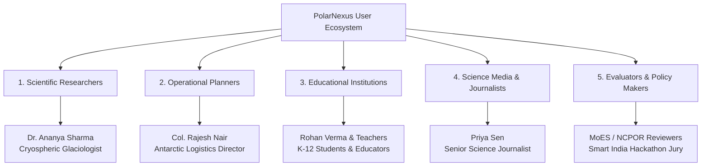

# Users & Stakeholder Personas

## 1. Overview of Stakeholder Ecosystem

PolarNexus is designed to serve a diverse spectrum of users—ranging from senior glaciological researchers planning multi-million dollar field campaigns to primary school students encountering polar science for the first time:

---

## 2. In-Depth Persona Profiles

### Persona 1: Dr. Ananya Sharma — Cryospheric Glaciologist
- **Role**: Senior Research Scientist, National Centre for Polar and Ocean Research.
- **Objective**: Correlate summer ice-shelf fracturing in Dronning Maud Land with katabatic wind episodes recorded over the past two decades.
- **Pain Points**:
  - Spends up to 15 hours per week manually downloading separate PDF reports from DSpace and CSV spreadsheets from NPDC.
  - Frustrated by OCR errors in 1980s expedition reports that corrupt latitude/longitude coordinates.
- **How PolarNexus Solves It**:
  - Instant discovery of all manuscripts matching *oceanological* and *meteorological* queries.
  - Interactive map plotting historical survey benchmarks with WGS-84 normalized coordinates.
  - Deterministic computation of wind-speed standard deviations directly from AWS sensor tables.

### Persona 2: Col. Rajesh Nair — Expedition Logistics Director
- **Role**: Operations Commander, Indian Antarctic Expedition Planning Committee.
- **Objective**: Determine optimal ice-berthing dates for chartered polar vessels arriving at India Bay (Antarctica) based on historical sea-ice facsimiles.
- **Pain Points**:
  - Legacy expedition reports contain sea-ice charts trapped as non-indexed image scans.
  - Difficulty quickly verifying historical storm tracks and low-pressure cell trajectories.
- **How PolarNexus Solves It**:
  - Figure extraction pipeline isolates synoptic weather facsimile charts from reports (e.g. 5th and 13th Expeditions).
  - Search engine surfaces specific storm encounters (e.g., 968 mb central pressure at 62°S).

### Persona 3: Rohan Verma & Smt. Lakshmi Iyer — Students & Educators
- **Role**: Grade 10 Student & High School Science Teacher.
- **Objective**: Prepare a state-level science exhibition project on *"India's Forty Years in Antarctica: From Dakshin Gangotri to Bharati"*.
- **Pain Points**:
  - Academic papers are overwhelming, full of mathematical physics and complex chemistry.
  - Popular search engines return confusing foreign station data (McMurdo, Rothera) rather than Indian achievements.
- **How PolarNexus Solves It**:
  - **Educational Outreach Hub** translates complex glaciological papers into engaging, school-appropriate explainers.
  - Interactive polar quiz and glossary clarify concepts like *polynyas*, *katabatic winds*, and *aurora australis*.

### Persona 4: Priya Sen — Science Journalist
- **Role**: Senior Environmental Correspondent, National Daily.
- **Objective**: Write an accurate feature article commemorating India's Arctic achievements at Himadri station.
- **Pain Points**:
  - Generic LLMs invent fake expedition numbers or misattribute Antarctic achievements to the Arctic.
  - Urgently requires verified facts, historical dates, and high-resolution media with proper institutional attribution.
- **How PolarNexus Solves It**:
  - Generates press-ready draft bulletins citing verified NCPOR DSpace handles.
  - Media gallery provides authenticated photographs with station names and photographer credentials.

### Persona 5: Hackathon Jury & Technical Evaluator
- **Role**: Senior Technologist, Smart India Hackathon (SIH 2026).
- **Objective**: Rigorously assess system architecture, code hygiene, security posture, and innovation against Problem Statement 26063.
- **Evaluation Criteria**:
  - Verifiable zero hallucination in scientific calculations.
  - Production-grade codebase with complete automated test coverage (`pytest -v`).
  - Strict separation of core documentation from specialized RAG/ML research blogs.
