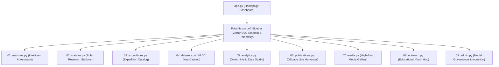

# Streamlit Application Architecture

## 1. Modular Multi-Page UI Framework

The PolarNexus web application is constructed on Streamlit, utilizing a modular multi-page architecture:

---

## 2. Branding & Styling Architecture
- **Enterprise Dark Theme**: Obsidian background (`#060B14`) with Arctic Cyan accents (`#38BDF8`).
- **Zero-Emoji Sidebar Component**: Custom SVG vector emblem featuring polar latitude circles and an 8-point compass star.
- **Dynamic DOM Repositioning**: Ensures the brand header is permanently fixed at the top of the sidebar above the navigation menu.
