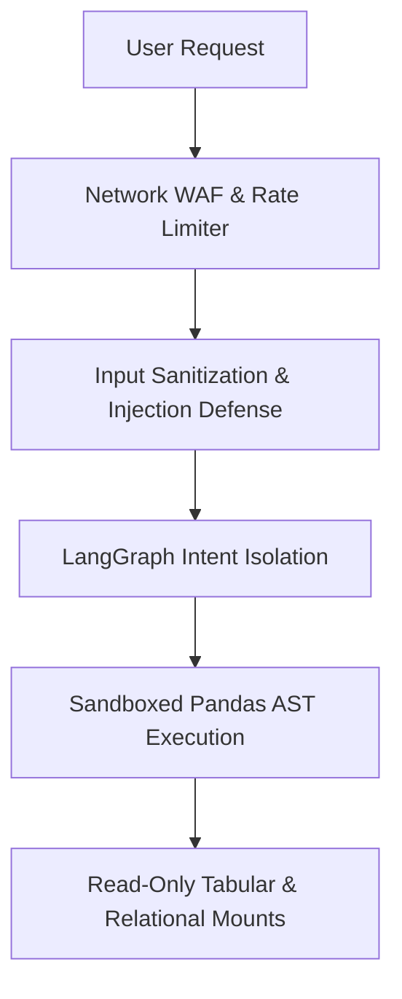

# Platform Security Overview

## 1. Multi-Layer Defense in Depth

PolarNexus enforces stringent security controls across code execution, database querying, bitstream ingestion, and user authentication:

